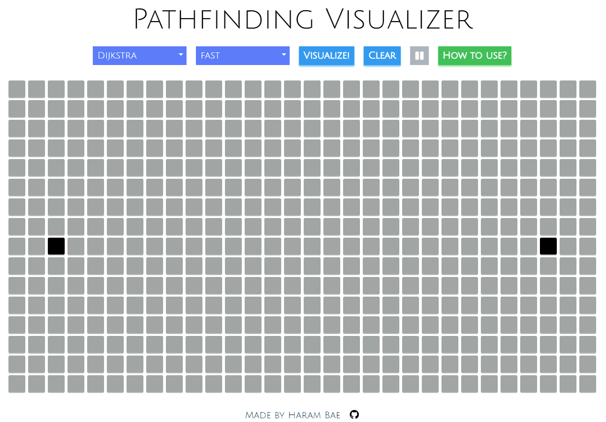

# Pathfinding Visualizer

### [LIVE DEMO](https://baeharam.github.io/Pathfinding-Visualizer/)



<br>

## Algorithms

* Dijkstra
* Bellman-Ford
* DFS
* 0-1 BFS
* A* with manhatten distance heuristic

<br>

## Technical Stack

|                  UI Library                   |                   Styling                    |                    Typing                    |
| :-------------------------------------------: | :------------------------------------------: | :------------------------------------------: |
|  |  |  |

<br>

## Build Guide

```bash
git clone https://github.com/baeharam/Pathfinding-Visualizer
cd Pathfinding-Visualizer
yarn install
yarn start
```

<br>

## LICENSE

[MIT]('./LICENSE.md')